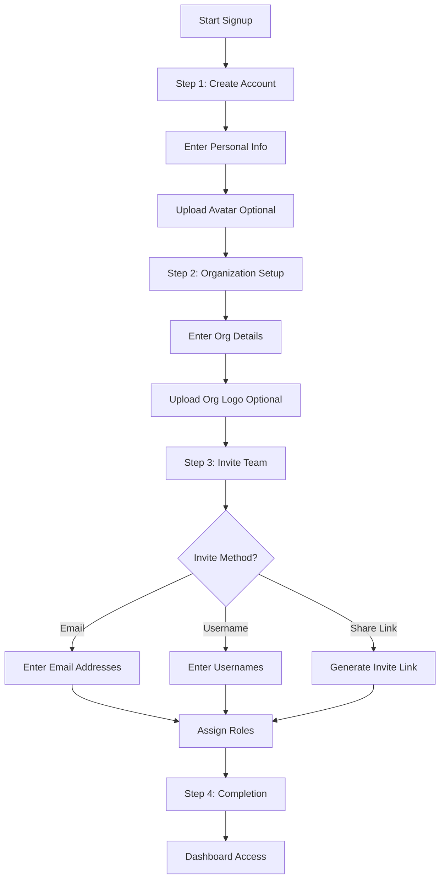
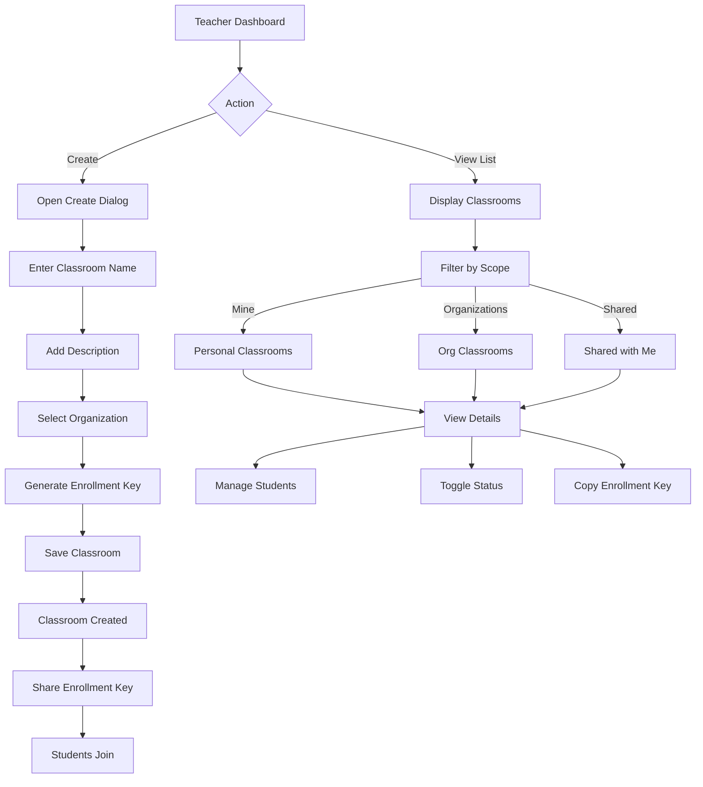
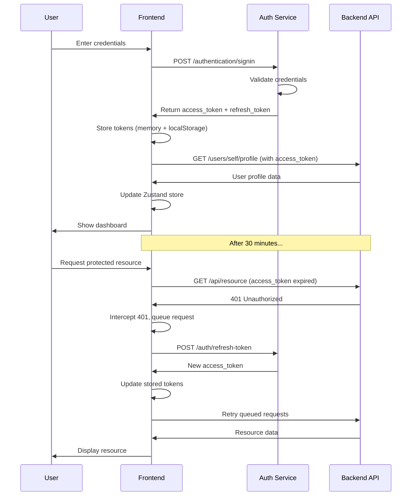
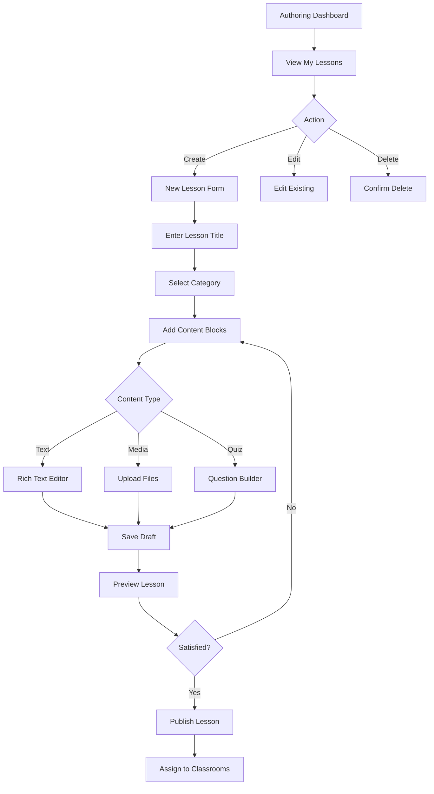
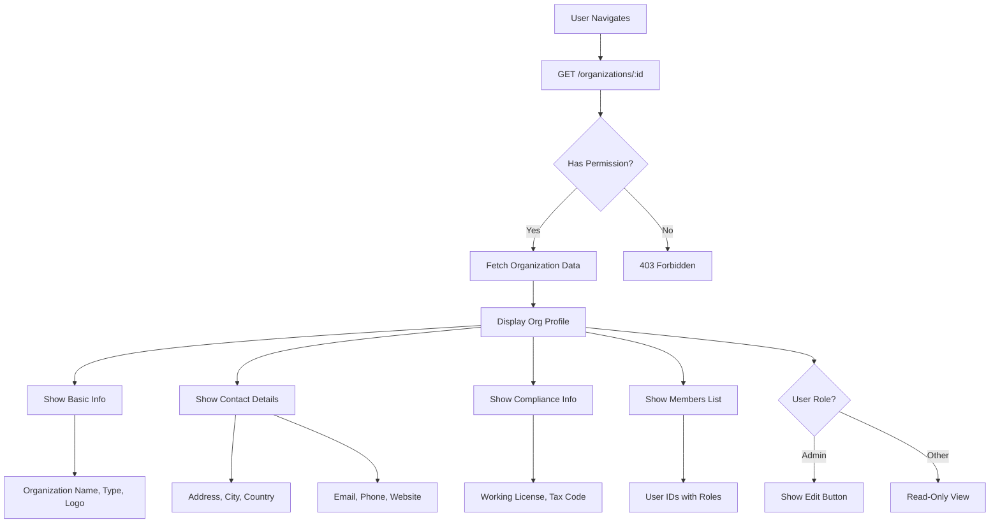

# Bravo Learning System - Project Introduction

<div align="center">
  
  <h3>Next-Generation Educational Platform</h3>
  <p><em>Empowering educational institutions with modern, scalable, and intuitive learning management</em></p>
</div>

---

## 📚 Table of Contents

1. [Business Overview](#-business-overview)
2. [Core Business Capabilities](#-core-business-capabilities)
3. [Target Users & Personas](#-target-users--personas)
4. [System Architecture](#-system-architecture)
5. [Key Business Flows](#-key-business-flows)
6. [Domain Logic](#-domain-logic)
7. [Technical Architecture](#-technical-architecture)
8. [Data Flow & State Management](#-data-flow--state-management)

---

## 🎯 Business Overview

**Bravo Learning System** is a comprehensive educational technology platform designed to streamline the management and delivery of educational content across various types of learning institutions including schools, universities, private educational centers, and corporate training organizations.

### Vision

To create a unified, flexible, and user-friendly platform that enables educational organizations to:

- Manage organizational structure and member roles efficiently
- Create and distribute educational content seamlessly
- Facilitate classroom management and student engagement
- Track learning progress and outcomes
- Scale from small training centers to large educational institutions

### Value Proposition

| Stakeholder                  | Value Delivered                                                                                        |
| ---------------------------- | ------------------------------------------------------------------------------------------------------ |
| **Educational Institutions** | Complete digital infrastructure for managing courses, classrooms, and learners with minimal setup time |
| **Administrators**           | Centralized control over organization settings, member permissions, and classroom oversight            |
| **Teachers/Instructors**     | Intuitive authoring tools, classroom management, and student engagement features                       |
| **Students**                 | Easy enrollment, access to learning materials, and clear learning pathways                             |
| **IT Departments**           | Modern, maintainable architecture with clear separation of concerns and extensibility                  |

---

## 💼 Core Business Capabilities

### 1. **Organization Management**

- Multi-tenant architecture supporting diverse organization types (School, University, Private Center, Company)
- Flexible organizational hierarchy and branding
- Member invitation and role-based access control
- Organization profile with compliance information (licenses, tax codes)

### 2. **Classroom Management**

- Create and configure virtual classrooms
- Manage student enrollment via enrollment keys
- Track classroom status (active/disabled)
- View and manage enrolled students
- Support for organization-level and shared classrooms

### 3. **Content Authoring**

- Lesson creation and management
- Category-based content organization
- Author-centric content workflows
- Template system for consistent content delivery

### 4. **User & Access Management**

- Comprehensive role-based permission system
  - **Supreme Administrator**: Full system control
  - **Administrator**: Organization-level management
  - **Teacher**: Content creation and classroom management
  - **Student**: Content consumption and participation
- Secure authentication with token refresh mechanisms
- Multi-step onboarding with profile completion

### 5. **Member Collaboration**

- Multiple invitation methods (email, username, share link)
- Role assignment during invitation
- Team member management within organizations

---

## 👥 Target Users & Personas

### Primary Personas

#### 1. **Organization Administrator (Sarah)**

- **Role**: School principal or training center owner
- **Goals**: Set up organization, invite staff, oversee all classrooms
- **Pain Points**: Complex setup processes, difficult permission management
- **Solution**: Streamlined multi-step signup, intuitive member management, centralized dashboard

#### 2. **Teacher/Instructor (Michael)**

- **Role**: Subject matter expert delivering courses
- **Goals**: Create engaging lessons, manage classroom activities, track student progress
- **Pain Points**: Time-consuming content creation, limited authoring tools
- **Solution**: Efficient authoring interface, reusable templates, quick classroom creation

#### 3. **Student/Learner (Emma)**

- **Role**: Active learner in classrooms
- **Goals**: Easy enrollment, access learning materials, track progress
- **Pain Points**: Complicated enrollment, unclear navigation
- **Solution**: Simple enrollment via keys, intuitive interface, clear course structure

#### 4. **IT Manager (David)**

- **Role**: Technical administrator maintaining the system
- **Goals**: Easy deployment, maintainable codebase, extensible architecture
- **Pain Points**: Monolithic systems, unclear code organization
- **Solution**: Domain-driven architecture, TypeScript safety, comprehensive documentation

---

## 🏗 System Architecture

### High-Level Architecture

```
┌─────────────────────────────────────────────────────────────┐
│                     Client Application                        │
│                    (React + TypeScript)                       │
├─────────────────────────────────────────────────────────────┤
│  ┌─────────────┐  ┌─────────────┐  ┌─────────────┐         │
│  │   Auth      │  │  Classroom  │  │  Authoring  │         │
│  │   Domain    │  │   Domain    │  │   Domain    │   ...   │
│  └─────────────┘  └─────────────┘  └─────────────┘         │
├─────────────────────────────────────────────────────────────┤
│                    Shared Infrastructure                      │
│   UI Components │ API Client │ Router │ State │ Utils       │
└─────────────────────────────────────────────────────────────┘
                              │
                              │ HTTPS/REST
                              ▼
┌─────────────────────────────────────────────────────────────┐
│                      Backend Services                         │
│  Authentication │ Authorization │ Data Storage │ File Upload │
└─────────────────────────────────────────────────────────────┘
```

### Domain-Driven Design

The system follows a **vertical slice architecture** where each business domain is self-contained:

```
src/domains/
  ├── auth/           # Authentication & Authorization
  │   ├── types.ts    # Domain types
  │   ├── apis/       # API client functions
  │   ├── queries/    # TanStack Query hooks
  │   ├── pages/      # Route components
  │   ├── components/ # Domain-specific UI
  │   ├── router.ts   # Route definitions
  │   └── storage/    # Local state (Zustand)
  │
  ├── classroom/      # Classroom Management
  │   └── [same structure]
  │
  ├── organization/   # Organization Management
  │   └── [same structure]
  │
  ├── authoring/      # Content Authoring
  │   └── [same structure]
  │
  └── course/         # Course Delivery (planned)
      └── [same structure]
```

**Benefits:**

- **Encapsulation**: Each domain owns its data, logic, and UI
- **Scalability**: New domains can be added without affecting existing ones
- **Maintainability**: Clear boundaries reduce cognitive load
- **Testability**: Domains can be tested in isolation

---

## 🔄 Key Business Flows

### 1. Organization Onboarding Flow

**Goal**: Enable new organizations to set up their account from scratch to ready-to-use state.



**Detailed Steps:**

#### Step 1: Create Account

- **Input**:
  - Full name, email, password
  - Job title, country, timezone
  - Phone number (optional)
  - Avatar image (optional, max 2MB)
- **Validation**:
  - Email uniqueness check
  - Password strength (min 8 chars, uppercase, lowercase, number, special)
  - Avatar file type and size validation
- **Output**: User profile created with `userId`

#### Step 2: Organization Setup

- **Input**:
  - Organization name, type (School/University/Private Center/Company)
  - Address, city, country
  - Contact email, phone (optional)
  - Website URL (optional)
  - Tax code (optional for compliance)
  - Logo image (optional, max 2MB)
- **Business Rules**:
  - Organization name must be unique within the system
  - Contact email can differ from user email
  - Logo follows allowed MIME types (jpg, png, webp)
- **Output**: Organization created with `organizationId`

#### Step 3: Invite Team Members

- **Options**:
  1. **Email Invitation**: Send personalized emails with invite links
  2. **Username Invitation**: Add existing users by username
  3. **Share Link**: Generate reusable link with expiration
- **Roles Available**:
  - Administrator (full org management)
  - Teacher (content creation, classroom management)
  - Student (content consumption)
- **Business Rules**:
  - Maximum 50 invitations per batch (configurable)
  - Invite links expire after 7 days (configurable)
  - Share links can have usage limits
- **Output**: Invitation records created, emails sent

#### Step 4: Completion

- **Actions**:
  - Auto-login with generated tokens
  - Redirect to organization dashboard
  - Display welcome notification
  - Show next steps guide
- **Output**: User has complete access to system

**Backend Endpoint**: `POST /authentication/signup`

**Payload Structure**:

```typescript
{
  createAccount: {
    avatarUrl?: string,
    fullname: string,
    job: string,
    email: string,
    password: string,
    country: string,
    timezone: string
  },
  organization: {
    organizationName: string,
    organizationType: string,
    city: string,
    country: string,
    contactEmail: string,
    // ... additional fields
  },
  inviteMember: {
    inviteMethod: "email" | "username" | "link",
    emails: string[],
    usernames: string[],
    role: string,
    message?: string
  }
}
```

---

### 2. Classroom Creation & Management Flow

**Goal**: Enable teachers to create classrooms and manage student enrollment.



**Detailed Operations:**

#### Create Classroom

- **Prerequisites**: User must have Teacher or Admin role
- **Input**:
  - Classroom name (required, 3-100 characters)
  - Description (optional, up to 500 characters)
  - Organization ID (auto-selected if user belongs to one org)
  - Enrollment key (auto-generated, 8 alphanumeric characters)
- **Business Rules**:
  - Classroom name must be unique within organization
  - Enrollment key must be unique system-wide
  - Default status is "active"
  - Creator automatically becomes classroom owner
- **Output**: Classroom created with unique ID

**API Endpoint**: `POST /classrooms`

#### Student Enrollment

- **Method 1: Via Enrollment Key**
  ```
  Student enters key → System validates →
  Checks classroom status → Adds student to roster
  ```
- **Method 2: Direct Addition**
  ```
  Teacher selects students → Assigns to classroom →
  Students receive notification
  ```

#### Classroom Status Management

- **Active**: Students can enroll, content is accessible
- **Disabled**: Enrollment blocked, existing students retain access but limited
- **Business Rules**:
  - Only classroom owner or org admin can change status
  - Disabling doesn't remove enrolled students
  - Status change is logged for audit

#### Scope Filtering

- **Mine**: Classrooms where user is owner
- **Organizations**: All classrooms in user's organization
- **Shared**: Classrooms user has been invited to
- **Purpose**: Helps users navigate large number of classrooms

---

### 3. User Authentication & Session Flow

**Goal**: Secure user authentication with automatic token refresh.



**Key Features:**

#### Token Management

- **Access Token**: Short-lived (30 min), used for API requests
- **Refresh Token**: Long-lived (7 days), used to obtain new access tokens
- **Storage Strategy**:
  - In-memory cache for fast access
  - localStorage for persistence across tabs
  - Automatic cleanup on logout

#### Automatic Refresh

- **Proactive Refresh**: Triggered 30 seconds before expiration
- **On-Demand Refresh**: Triggered on 401 responses
- **Queue Mechanism**: Failed requests are queued and retried after refresh
- **Single-Flight**: Only one refresh request at a time, others wait

#### Security Measures

- Tokens cleared on logout or refresh failure
- Redirect to login on token expiration
- HTTPS-only in production
- No sensitive data in URL params

---

### 4. Content Authoring Flow

**Goal**: Enable teachers to create and organize educational content.



**Content Structure:**

- **Lesson**: Top-level content unit
  - Title, description, category
  - Author information
  - Creation and update timestamps
  - Status (draft/published/archived)
- **Content Blocks**: Composable units within a lesson
  - Text blocks (Markdown/Rich text)
  - Media blocks (images, videos, documents)
  - Interactive blocks (quizzes, exercises)
  - Embeds (external resources)

**Planned Features:**

- Template system for common lesson structures
- Version control for content
- Collaborative editing
- Content analytics (views, completion rates)

---

### 5. Organization Detail View Flow

**Goal**: Display comprehensive organization information to authorized users.



**Data Structure:**

```typescript
Organization {
  id: string
  name: string
  organizationType: string
  logoUrl?: string
  slogan?: string
  address?: string
  city: string
  country: string
  phoneNumber?: string
  contactEmail: string
  websiteUrl?: string
  workingLicense: string
  size?: number
  chairmanName: string
  chairmanIdentification: string
  region: string
  taxCode?: string
  createdAt: datetime
  updatedAt: datetime
  users: [{
    userId: string
    roles: ["SUPREME_ADMINISTRATOR" | "ADMIN" | "TEACHER" | "STUDENT"]
  }]
}
```

---

## 🧩 Domain Logic

### Authentication Domain (`auth`)

**Responsibilities:**

- User login/logout
- Multi-step signup wizard
- Token management (storage, refresh)
- User profile management
- Avatar upload

**Key Business Rules:**

- Passwords must meet complexity requirements
- Email addresses must be unique
- Failed login attempts are rate-limited (planned)
- Tokens expire and auto-refresh
- User can belong to only one organization initially

**State Management:**

```typescript
AuthStore {
  id: string
  fullname: string
  email: string
  jobTitle: string
  country: string
  accessToken: string
  refreshToken: string
  username: string

  setUserData()
  renewToken()
  revokeAccessToken()
}
```

---

### Classroom Domain (`classroom`)

**Responsibilities:**

- Classroom CRUD operations
- Student enrollment management
- Enrollment key generation and validation
- Classroom status management (active/disabled)
- Multi-scope filtering (mine/org/shared)

**Key Business Rules:**

- Enrollment keys must be unique globally
- Only active classrooms accept new enrollments
- Classroom creators have owner privileges
- Students can be in multiple classrooms
- Disabling classroom doesn't remove students

**Data Flow:**

```
List View:
  User → classroomsRoute → useClassroomsQuery(filters) →
  fetchClassrooms(filters) → API → Display table/cards

Detail View:
  User → classroomDetailRoute → useClassroomQuery(id) →
  fetchClassroom(id) → API → Display details + students

Create:
  User → CreateClassroomDialog → useCreateClassroomMutation →
  createClassroom(payload) → API → Invalidate list cache → Refresh

Status Toggle:
  User → Toggle button → useToggleClassroomStatusMutation →
  toggleClassroomStatus(id, status) → API → Update cache → Re-render
```

**Query Keys:**

```typescript
CLASSROOM_QUERY_KEYS = {
  list: (filters) => ["classrooms", filters],
  detail: (id) => ["classroom", id],
  students: (id) => ["classroom", id, "students"],
};
```

---

### Organization Domain (`organization`)

**Responsibilities:**

- Organization profile display
- Organization member management
- Organization settings (planned)
- Compliance information tracking

**Key Business Rules:**

- Organization name must be unique
- Contact email can differ from admin email
- Logo has size and type restrictions (2MB, jpg/png/webp)
- Tax code and working license required for certain regions
- One Supreme Administrator per organization minimum

**API Integration:**

```typescript
// Fetch organization detail
GET /service/v1/organizations/:id

Response: {
  id: string
  name: string
  organizationType: string
  // ... all org fields
  users: [{
    userId: string
    roles: string[]
  }]
}
```

---

### Authoring Domain (`authoring`)

**Responsibilities:**

- Lesson creation and editing
- Category management
- Author-centric lesson listing
- Template system (planned)
- Content versioning (planned)

**Key Business Rules:**

- Lessons belong to authors (creators)
- Categories organize content hierarchically
- Draft lessons are private until published
- Published lessons can be assigned to classrooms
- Authors can edit their own content only

**Current Status**: Foundation with placeholders for future expansion

---

### User Domain (Shared Hook)

**New Feature**: `useCurrentUser` hook

**Purpose**: Provide unified access to current user profile, role, and organization.

**Data Structure:**

```typescript
CurrentUser {
  personalInfo: {
    id, fullname, email, jobTitle, country,
    authId, createdAt, updatedAt
  }
  role: {
    id, name
  }
  organization: Organization | null
  organizationId: string | null
}
```

**Usage Pattern:**

```typescript
function DashboardHeader() {
  const { currentUser, isLoading } = useCurrentUser();

  if (isLoading) return <Skeleton />;

  return (
    <div>
      <h1>Welcome, {currentUser.personalInfo.fullname}</h1>
      <Badge>{currentUser.role.name}</Badge>
      <p>{currentUser.organization?.name}</p>
    </div>
  );
}
```

---

## 🏛 Technical Architecture

### Layer Separation

```
┌─────────────────────────────────────────┐
│         Presentation Layer              │
│  - React Components                     │
│  - Pages & Layouts                      │
│  - UI Component Library (shadcn/ui)     │
└─────────────────────────────────────────┘
                  ↓
┌─────────────────────────────────────────┐
│         Application Layer               │
│  - TanStack Router (routing)            │
│  - TanStack Query (data fetching)       │
│  - React Hook Form (forms)              │
│  - Zustand (local state)                │
└─────────────────────────────────────────┘
                  ↓
┌─────────────────────────────────────────┐
│         Domain Layer                    │
│  - Business logic per domain            │
│  - Type definitions                     │
│  - API client functions                 │
│  - Query hooks                          │
└─────────────────────────────────────────┘
                  ↓
┌─────────────────────────────────────────┐
│         Infrastructure Layer            │
│  - Axios HTTP client                    │
│  - Token interceptors                   │
│  - File upload utilities                │
│  - Environment configuration            │
└─────────────────────────────────────────┘
```

### Technology Stack

| Category          | Technology            | Purpose                                 |
| ----------------- | --------------------- | --------------------------------------- |
| **Core**          | React 19              | UI framework                            |
| **Language**      | TypeScript 5          | Type safety                             |
| **Build Tool**    | Vite 7 + SWC          | Fast HMR, optimized builds              |
| **Routing**       | TanStack Router       | Type-safe routing with colocated routes |
| **Data Fetching** | TanStack Query        | Server state management, caching        |
| **HTTP Client**   | Axios                 | REST API communication                  |
| **Forms**         | React Hook Form + Zod | Form state + validation                 |
| **UI Library**    | shadcn/ui + Radix UI  | Accessible component primitives         |
| **Styling**       | Tailwind CSS          | Utility-first CSS                       |
| **Icons**         | Lucide React          | SVG icon library                        |
| **Notifications** | Sonner                | Toast notifications                     |
| **State**         | Zustand               | Lightweight state management            |

### Design Patterns

#### 1. Query Key Factory Pattern

```typescript
export const CLASSROOM_QUERY_KEYS = {
  list: (filters) => ["classrooms", filters] as const,
  detail: (id) => ["classroom", id] as const,
  students: (id) => ["classroom", id, "students"] as const,
};
```

**Benefits**: Centralized cache key management, type safety, easy invalidation

#### 2. Custom Hook Pattern

```typescript
export function useClassroomQuery(id: string) {
  return useQuery({
    queryKey: CLASSROOM_QUERY_KEYS.detail(id),
    queryFn: () => fetchClassroom(id),
    enabled: !!id,
  });
}
```

**Benefits**: Encapsulation, reusability, consistent API

#### 3. Axios Interceptor Pattern

```typescript
authInstance.interceptors.response.use(
  (res) => res,
  async (error) => {
    if (error.response?.status === 401) {
      // Auto refresh token and retry
    }
    return Promise.reject(error);
  }
);
```

**Benefits**: Transparent token refresh, reduced boilerplate

#### 4. Composition Pattern

```typescript
function useCurrentUser() {
  const user = useGetUser();
  const org = useOrganizationQuery(user.organizationId);
  return { user, org, isLoading: user.isLoading || org.isLoading };
}
```

**Benefits**: Combine multiple data sources, clean API

---

## 📊 Data Flow & State Management

### Server State (TanStack Query)

**Purpose**: Manage asynchronous data fetched from APIs

**Flow:**

```
Component → Hook → Query Key → Cache Check → API Call → Cache Update → Re-render
```

**Features:**

- Automatic background refetch
- Optimistic updates (planned)
- Cache invalidation on mutations
- Stale-while-revalidate strategy
- Loading and error states

**Example:**

```typescript
// In component
const { data, isLoading, error, refetch } = useClassroomsQuery({
  scope: "mine",
  search: "math",
});

// Automatic caching by query key
// Subsequent calls with same key return cached data
```

### Local State (Zustand)

**Purpose**: Manage client-side state (auth tokens, UI preferences)

**Flow:**

```
Component → Store Hook → Selector → State → Action → State Update → Re-render
```

**Example:**

```typescript
const useAuthStore = create(
  persist(
    (set) => ({
      accessToken: "",
      refreshToken: "",
      renewToken: (tokens) => set({ ...tokens }),
    }),
    { name: "auth-storage" }
  )
);
```

### Component State (useState)

**Purpose**: Manage local UI state (form inputs, modals, toggles)

**When to Use:**

- Dialog open/close state
- Form field values (before submission)
- Temporary UI flags
- Local search/filter state

### Routing State (TanStack Router)

**Purpose**: Manage URL-based state (filters, pagination, active IDs)

**Flow:**

```
URL Change → Router Validation → Component Re-render → Query Refetch
```

**Example:**

```typescript
// URL: /classrooms?scope=mine&q=math
const search = useSearch({ from: "/auth/classrooms" });
// search = { scope: "mine", q: "math" }

const { data } = useClassroomsQuery({
  scope: search.scope,
  search: search.q,
});
```

---

## 🔐 Security & Permissions

### Role-Based Access Control (RBAC)

| Role                      | Permissions                                              |
| ------------------------- | -------------------------------------------------------- |
| **Supreme Administrator** | All operations, cross-organization                       |
| **Administrator**         | Organization management, all classrooms, user management |
| **Teacher**               | Create classrooms, author content, manage own classrooms |
| **Student**               | Enroll in classrooms, access content, submit assignments |

### Permission Checks

```typescript
// Route-level protection
export const authenticatedRoute = createRoute({
  beforeLoad: () => {
    const token = getAccessToken();
    if (!token) throw redirect({ to: "/login" });
  },
});

// Component-level protection
function EditButton() {
  const { currentUser } = useCurrentUser();
  const isAdmin = currentUser.role.id === "admin";

  if (!isAdmin) return null;
  return <Button>Edit</Button>;
}
```

### Data Privacy

- User passwords are never stored in frontend
- Tokens stored in memory + localStorage (encrypted in production)
- Sensitive data excluded from logs
- HTTPS enforced in production
- CORS configured for specific origins

---

## 🚀 Future Roadmap

### Phase 2: Enhanced Classroom Features

- Assignment creation and submission
- Grading system
- Attendance tracking
- Real-time notifications
- Discussion forums

### Phase 3: Advanced Authoring

- Rich media editor
- Interactive exercises
- Assessment builder
- Learning path designer
- Content marketplace

### Phase 4: Analytics & Insights

- Student progress dashboards
- Performance analytics
- Engagement metrics
- Predictive insights
- Automated reporting

### Phase 5: Collaboration & Communication

- Real-time chat
- Video conferencing integration
- Collaborative documents
- Peer review system
- Parent portal

---

## 📈 Success Metrics

### Business KPIs

- Organizations onboarded per month
- Active classrooms
- Student enrollment rate
- Content creation velocity (lessons/week)
- User retention rate (90-day)

### Technical KPIs

- Page load time < 2s
- API response time < 500ms
- Uptime > 99.9%
- Build time < 5min
- Test coverage > 80%

---

## 🤝 Contributing

This system is designed for extensibility. New features should:

1. Follow domain-driven structure
2. Maintain type safety end-to-end
3. Include comprehensive error handling
4. Provide loading and empty states
5. Document business rules clearly

---

## 📄 License

Currently private / internal. Contact repository owners for licensing information.

---

<div align="center">
  <p><strong>Built with ❤️ by the Bravo Team</strong></p>
  <p><em>Empowering education through technology</em></p>
</div>
