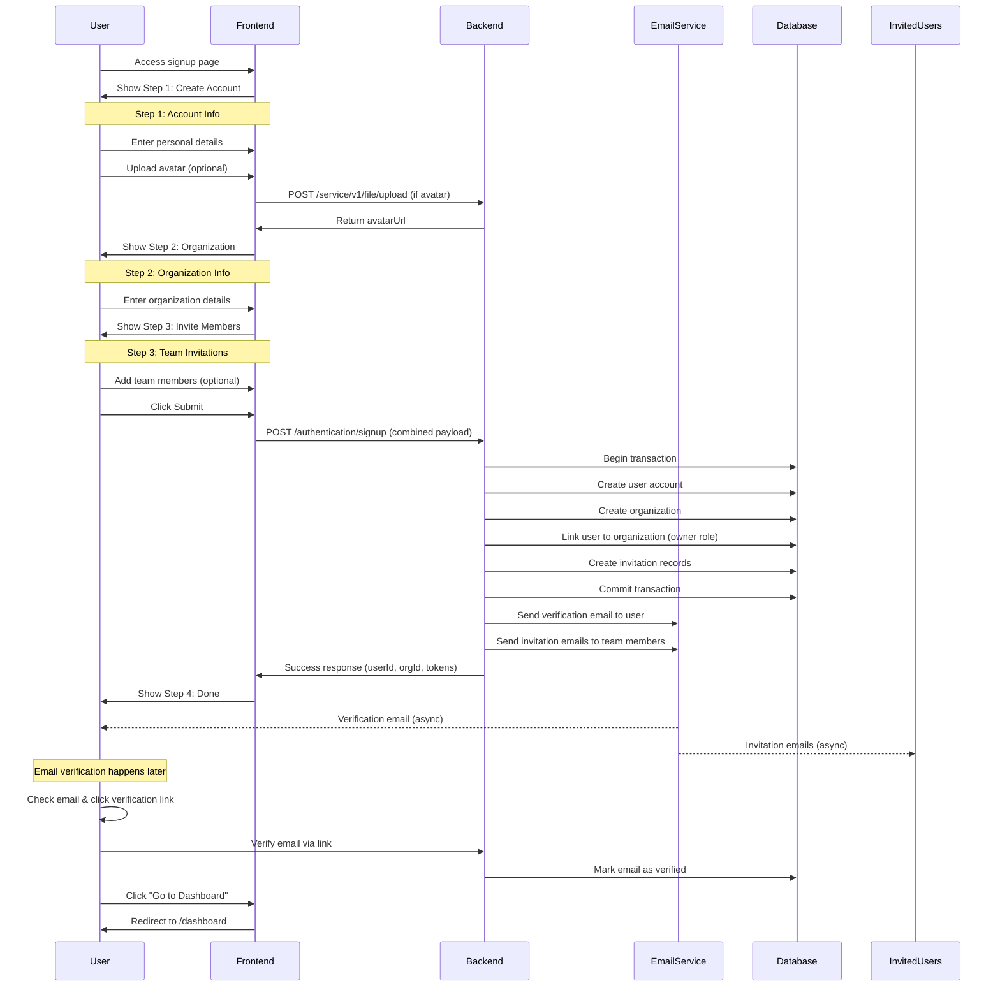

# Signup Flow - Actual Implementation

## Overview

This document describes the **actual implemented** signup flow in the Bravo Learning System. The system uses a **single combined endpoint** that handles user registration, organization creation, and member invitations in one transaction.

## Architecture

- **Frontend**: 4-step wizard with combined submission
- **Backend**: Single `/authentication/signup` endpoint
- **Email Verification**: Handled asynchronously after signup (user receives email, verifies later)

---

## Flow Diagram



---

## Frontend Steps (4-Step Wizard)

### Step 1: Create Account

**Component**: `src/domains/auth/components/signup/create-account-step/`

**Fields:**

- Avatar upload (optional, with crop/zoom)
- Full name (required)
- Email (required, validated)
- Password (required, with strength indicator)
- Confirm password (required, must match)
- Country (required, dropdown)
- Job title (required)
- Phone (optional)
- Timezone (required, auto-detected)

**Validations:**

- Email: Valid format
- Password: Min 8 chars, 1 uppercase, 1 lowercase, 1 number
- Full name: Min 2 chars
- All required fields must be filled

**Avatar Upload:**

- Separate endpoint: `POST /service/v1/file/upload`
- Path: `/pre-signup/{YYYYMMDD_HHmmss}`
- Returns: `avatarUrl` to include in signup payload

---

### Step 2: Organization

**Component**: `src/domains/auth/components/signup/organization-creation-form/`

**Fields:**

- Organization name (required)
- Organization type (required, dropdown)
- Address (optional)
- City (required)
- Country (required, dropdown)
- Contact email (required)
- Contact phone (optional)
- Website (optional)
- Tax code (optional)

**Validations:**

- Organization name: Min 2 chars
- Contact email: Valid format
- Website: Valid URL format (if provided)

---

### Step 3: Invite Members

**Component**: `src/domains/auth/components/signup/invite-member-form/`

**Fields:**

- Invite method: `email | username | link` (radio buttons)
- Email list (if method = email)
- Username list (if method = username)
- Role (dropdown, default: "member")
- Message (optional, for invitation email)

**Features:**

- Add/remove multiple members
- Skip step if no invitations
- **Triggers full signup submission**

**Validations:**

- At least one email or username (if inviting)
- Valid email/username format
- Role must be selected

---

### Step 4: Done

**Component**: `src/domains/auth/components/signup/done-step/`

**Display:**

- Success icon (checkmark)
- Welcome message
- Organization name
- User email
- Next steps checklist:
  - ✓ Check your email for verification
  - ✓ Complete your organization profile
  - ✓ Set up your workspace

**Actions:**

- "Complete Profile" button → `/settings`
- "Go to Dashboard" button → `/dashboard`

---

## Backend API

### Main Endpoint

```
POST /authentication/signup
Content-Type: application/json
```

### Request Payload

```typescript
type TSignupFullRequest = {
  createAccount: {
    avatarUrl?: string; // URL from pre-upload
    fullname: string; // Min 2 chars
    job: string; // Job title
    email: string; // Unique, valid format
    password: string; // Min 8 chars, complex
    confirm: string; // Must match password (frontend validation)
    country: string; // ISO country code
    phone?: string; // Optional
    timezone: string; // IANA timezone (e.g., "America/New_York")
  };
  organization: {
    organizationName: string; // Min 2 chars
    organizationType: string; // e.g., "school", "university", "corporate"
    address?: string; // Optional
    city: string; // Required
    country: string; // ISO country code
    contactEmail: string; // Valid email format
    contactPhone?: string; // Optional
    website?: string; // Valid URL (optional)
    taxCode?: string; // Optional
  };
  inviteMember: {
    inviteMethod: "email" | "username" | "link";
    emails: string[]; // If method = "email"
    usernames: string[]; // If method = "username"
    role: string; // Role ID or code (e.g., "member", "teacher")
    message?: string; // Optional invitation message
  };
};
```

### Response

```typescript
type TSignupFullResponse = {
  userId: string; // Created user ID
  organizationId: string; // Created organization ID
  invitesProcessed: number; // Number of invitations sent
  access_token?: string; // JWT access token (optional)
  refresh_token?: string; // JWT refresh token (optional)
};
```

**Wrapped in standard envelope:**

```typescript
{
  success: boolean;
  message: string;
  data: TSignupFullResponse;
}
```

---

## Backend Processing

### Transaction Flow

1. **Validate Request**

   - Check all required fields
   - Validate email format and uniqueness
   - Validate password strength
   - Validate organization name uniqueness

2. **Create User**

   - Hash password (bcrypt)
   - Store user record with `emailVerified: false`
   - Generate verification token
   - Link to timezone

3. **Create Organization**

   - Store organization record
   - Set status to `active`
   - Link contact details

4. **Link User to Organization**

   - Create `organizationUser` record
   - Set role to `owner` (highest permission)
   - Set status to `active`

5. **Process Invitations**

   - Create invitation records for each member
   - Generate unique invitation tokens
   - Set expiry date (e.g., 7 days)

6. **Send Emails (Async)**

   - Queue verification email to user
   - Queue invitation emails to team members
   - Include appropriate links and context

7. **Generate Tokens (Optional)**

   - Create JWT access token
   - Create JWT refresh token
   - Return to frontend for immediate login

8. **Commit Transaction**
   - All-or-nothing: if any step fails, rollback everything

---

## Error Handling

### Validation Errors

```typescript
{
  success: false,
  message: "Validation failed",
  errorCode: "VALIDATION_ERROR",
  errors: [
    { field: "email", message: "Email is already registered" },
    { field: "password", message: "Password must be at least 8 characters" }
  ]
}
```

### Common Error Codes

- `EMAIL_EXISTS`: Email already registered
- `ORG_NAME_TAKEN`: Organization name already exists
- `WEAK_PASSWORD`: Password doesn't meet requirements
- `INVALID_EMAIL`: Invalid email format
- `INVITATION_LIMIT`: Too many invitations in request
- `RATE_LIMIT_EXCEEDED`: Too many signup attempts

### HTTP Status Codes

- `200 OK`: Signup successful
- `400 Bad Request`: Validation error
- `409 Conflict`: Email or org name already exists
- `429 Too Many Requests`: Rate limit exceeded
- `500 Internal Server Error`: Server error

---

## Email Verification Flow

### Verification Email

**Sent to**: User's email (from `createAccount.email`)

**Contains**:

- Welcome message
- Verification link: `https://app.example.com/verify-email?token={token}`
- Token expiry notice (e.g., 24 hours)
- Support contact

**Token Format**:

- JWT or random string
- Contains: userId, email, expiry
- Single-use only

### Verification Endpoint

```
GET /authentication/verify-email?token={token}
```

**Response:**

```typescript
{
  success: boolean;
  message: string;
  data: {
    verified: boolean;
    userId: string;
  }
}
```

**Processing:**

1. Validate token (not expired, not used)
2. Update user record: `emailVerified: true`
3. Mark token as used
4. Redirect to login or dashboard

---

## Frontend Implementation

### State Management

**File**: `src/domains/auth/components/signup/form.tsx`

```typescript
type TSignupProgress = {
  currentStep: number; // 1-4
  data: {
    createAccount?: Partial<TSignupCreateAccount>;
    organization?: Partial<TSignupOrganization>;
    inviteMember?: Partial<TSignupInviteMember>;
  };
};
```

### Mutation Hook

**File**: `src/domains/auth/queries/index.ts`

```typescript
export const useFullSignupMutation = (params?: {
  onSuccess?: (data: TSignupFullResponse) => void;
  onError?: (error: AxiosError) => void;
}) => {
  const { renewToken } = useAuthStore();

  return useMutation({
    mutationKey: ["signup-full"],
    mutationFn: (payload: TSignupFullRequest) => signupFull(payload),
    onSuccess: (res: TReponse<TSignupFullResponse>) => {
      // If backend returns tokens, persist them
      const { access_token, refresh_token } = res.body;
      if (access_token) {
        renewToken({
          accessToken: access_token,
          refreshToken: refresh_token || "",
        });
      }
      params?.onSuccess?.(res.body);
    },
    onError: params?.onError,
  });
};
```

### API Call

**File**: `src/domains/auth/apis/index.ts`

```typescript
export const signupFull = async (
  payload: TSignupFullRequest
): Promise<TReponse<TSignupFullResponse>> => {
  const response = await nonAuthInstance.post(
    "/authentication/signup",
    payload
  );
  return response.data;
};
```

---

## Security Considerations

### Rate Limiting

- **Signup attempts**: 10 per hour per IP
- **Email verification**: 5 attempts per hour per email
- **Invitation sending**: 50 per day per organization

### Password Requirements

- Minimum 8 characters
- At least 1 uppercase letter
- At least 1 lowercase letter
- At least 1 number
- At least 1 special character

### Token Security

- Verification tokens expire after 24 hours
- Invitation tokens expire after 7 days
- Tokens are single-use only
- JWTs signed with secure secret

### Data Validation

- Email format validation (RFC 5322)
- SQL injection prevention (parameterized queries)
- XSS prevention (input sanitization)
- CSRF protection (token-based)

---

## Testing Checklist

### Happy Path

- [ ] User completes all 4 steps
- [ ] Avatar upload works
- [ ] Organization created successfully
- [ ] Invitations sent
- [ ] Verification email received
- [ ] User can verify email
- [ ] User can log in after verification

### Error Cases

- [ ] Duplicate email shows error
- [ ] Weak password rejected
- [ ] Invalid email format rejected
- [ ] Duplicate organization name rejected
- [ ] Network error handled gracefully
- [ ] Expired verification token shows error

### Edge Cases

- [ ] Signup without avatar
- [ ] Signup without invitations
- [ ] Very long organization name
- [ ] Special characters in names
- [ ] International phone numbers
- [ ] Different timezones

---

## Migration Notes

### Old Documentation

The file `docs/signup-flow.md` describes a **different architecture** with:

- 5 separate steps with individual API calls
- Step-by-step progression: Register → Verify Email → Create Org → Invite → Complete
- Separate endpoints: `/api/auth/register`, `/api/auth/verify-email`, `/api/organizations`

**This is NOT the current implementation.**

### Current Implementation

- **4-step wizard** with single combined submission
- **One endpoint**: `/authentication/signup`
- **Email verification after signup** (not a blocking step)

### Why the Change?

- Better user experience (fewer API calls, faster signup)
- Atomic transaction (all-or-nothing approach)
- Reduced network latency
- Simpler error handling
- Email verification can happen anytime (not blocking)

---

## Troubleshooting

### Common Issues

**Issue**: "Email already exists" error

- **Cause**: User previously registered with this email
- **Solution**: Provide "Already have an account? Log in" link

**Issue**: Verification email not received

- **Cause**: Email in spam, wrong email address, email service delay
- **Solution**: Provide "Resend verification email" option

**Issue**: Organization name taken

- **Cause**: Another org already has this name
- **Solution**: Suggest alternatives (e.g., "Acme School 2", "Acme School NYC")

**Issue**: Invitations not sent

- **Cause**: Invalid email addresses, email service failure
- **Solution**: Show which invitations failed, allow retry

**Issue**: Cannot upload avatar

- **Cause**: File too large, wrong format, network error
- **Solution**: Show file size limit (e.g., 5MB), allowed formats (jpg, png)

---

## API Response Examples

### Success Response

```json
{
  "success": true,
  "message": "Signup completed successfully",
  "data": {
    "userId": "user_abc123",
    "organizationId": "org_xyz789",
    "invitesProcessed": 3,
    "access_token": "eyJhbGciOiJIUzI1NiIsInR5cCI6IkpXVCJ9...",
    "refresh_token": "eyJhbGciOiJIUzI1NiIsInR5cCI6IkpXVCJ9..."
  }
}
```

### Error Response (Validation)

```json
{
  "success": false,
  "message": "Validation failed",
  "errorCode": "VALIDATION_ERROR",
  "errors": [
    {
      "field": "createAccount.email",
      "message": "Email is already registered"
    },
    {
      "field": "organization.organizationName",
      "message": "Organization name must be at least 2 characters"
    }
  ]
}
```

### Error Response (Conflict)

```json
{
  "success": false,
  "message": "Email already exists",
  "errorCode": "EMAIL_EXISTS"
}
```

---

## Related Files

### Frontend

- `src/domains/auth/components/signup/form.tsx` - Main wizard
- `src/domains/auth/components/signup/create-account-step/` - Step 1
- `src/domains/auth/components/signup/organization-creation-form/` - Step 2
- `src/domains/auth/components/signup/invite-member-form/` - Step 3
- `src/domains/auth/components/signup/done-step/` - Step 4
- `src/domains/auth/queries/index.ts` - useFullSignupMutation
- `src/domains/auth/apis/index.ts` - signupFull API call
- `src/domains/auth/types.ts` - Type definitions

### Documentation

- `docs/signup-flow.md` - **OLD** architecture (not implemented)
- `docs/signup-flow-actual.md` - **THIS FILE** (current implementation)

---

## Changelog

- **2025-12-08**: Created actual implementation documentation
- Initial version based on current codebase analysis
